Big Mart Sales
================
Manikanta
December 9, 2016

``` r
knitr::opts_chunk$set(echo = FALSE)
```

Kaggle and Analytics Vidya are the best places to learn from other data scientists. I have participated in few data science competitions on both platforms. Data Science competitions generally takes place like this, first companies provide data and prize money to setup competitions, they provide few weeks of time to compete. if you end up in top 10 you might get a chance(/ have to) to present your results. As far as Beginners, if you missed the competition or not able to get decent score on dashboards, you can take up this data sets and practice on it, try different models, features, try all the things you learnt in theory and also learn from solutions of other data scientists. This is my contribution to data science begineers and Analytics Vidya community.

This is a Regression-Predictive Modelling Problem (Predictor/resonse variable is continous). More about the problem, and where you can find the datasets is given below.

Table of contents
=================

Table of contents

1.  Introduction
2.  Understanding the problem, Hypothesis Generation, Variable Identification
3.  Data exploration and Visualization, Univariate Analysis, Bi-variate, Statistical Tests
4.  Data Preprocessing, Missing Value Treatment, Handling Outliers, Variable transformation (encode categorical variables if necessary), Feature Engineering
5.  Proper Validation
6.  Model Selection and Building
7.  Summary

Introduction
------------

Given is the sales data of 10 BigMart store chains in various cities. Data contains 1559 products across 10 stores. Our aim is to build a predictive model to find the key parameters related to product and/or stores,that contribute to increase in sales.

Data sets, Description of Variables can be can be found [here](http://datahack.analyticsvidhya.com/practice-problem-bigmart-sales-prediction)

BigMart Sales was a data science competition conducted by [AnalyticsVidya](https://www.analyticsvidya.com) platform. Now the data sets are available for practice.

Understanding the problem
-------------------------

The idea is to find the key properties of product and stores that can impact the sales of different products. Let's take a look at the data first.

    ## 'data.frame':    8523 obs. of  12 variables:
    ##  $ Item_Identifier          : Factor w/ 1559 levels "DRA12","DRA24",..: 157 9 663 1122 1298 759 697 739 441 991 ...
    ##  $ Item_Weight              : num  9.3 5.92 17.5 19.2 8.93 ...
    ##  $ Item_Fat_Content         : Factor w/ 5 levels "LF","low fat",..: 3 5 3 5 3 5 5 3 5 5 ...
    ##  $ Item_Visibility          : num  0.016 0.0193 0.0168 0 0 ...
    ##  $ Item_Type                : Factor w/ 16 levels "Baking Goods",..: 5 15 11 7 10 1 14 14 6 6 ...
    ##  $ Item_MRP                 : num  249.8 48.3 141.6 182.1 53.9 ...
    ##  $ Outlet_Identifier        : Factor w/ 10 levels "OUT010","OUT013",..: 10 4 10 1 2 4 2 6 8 3 ...
    ##  $ Outlet_Establishment_Year: int  1999 2009 1999 1998 1987 2009 1987 1985 2002 2007 ...
    ##  $ Outlet_Size              : Factor w/ 4 levels "","High","Medium",..: 3 3 3 1 2 3 2 3 1 1 ...
    ##  $ Outlet_Location_Type     : Factor w/ 3 levels "Tier 1","Tier 2",..: 1 3 1 3 3 3 3 3 2 2 ...
    ##  $ Outlet_Type              : Factor w/ 4 levels "Grocery Store",..: 2 3 2 1 2 3 2 4 2 2 ...
    ##  $ Item_Outlet_Sales        : num  3735 443 2097 732 995 ...

    ##  Item_Identifier  Item_Weight     Item_Fat_Content Item_Visibility  
    ##  FDG33  :  10    Min.   : 4.555   LF     : 316     Min.   :0.00000  
    ##  FDW13  :  10    1st Qu.: 8.774   low fat: 112     1st Qu.:0.02699  
    ##  DRE49  :   9    Median :12.600   Low Fat:5089     Median :0.05393  
    ##  DRN47  :   9    Mean   :12.858   reg    : 117     Mean   :0.06613  
    ##  FDD38  :   9    3rd Qu.:16.850   Regular:2889     3rd Qu.:0.09459  
    ##  FDF52  :   9    Max.   :21.350                    Max.   :0.32839  
    ##  (Other):8467    NA's   :1463                                       
    ##                  Item_Type       Item_MRP      Outlet_Identifier
    ##  Fruits and Vegetables:1232   Min.   : 31.29   OUT027 : 935     
    ##  Snack Foods          :1200   1st Qu.: 93.83   OUT013 : 932     
    ##  Household            : 910   Median :143.01   OUT035 : 930     
    ##  Frozen Foods         : 856   Mean   :140.99   OUT046 : 930     
    ##  Dairy                : 682   3rd Qu.:185.64   OUT049 : 930     
    ##  Canned               : 649   Max.   :266.89   OUT045 : 929     
    ##  (Other)              :2994                    (Other):2937     
    ##  Outlet_Establishment_Year Outlet_Size   Outlet_Location_Type
    ##  Min.   :1985                    :2410   Tier 1:2388         
    ##  1st Qu.:1987              High  : 932   Tier 2:2785         
    ##  Median :1999              Medium:2793   Tier 3:3350         
    ##  Mean   :1998              Small :2388                       
    ##  3rd Qu.:2004                                                
    ##  Max.   :2009                                                
    ##                                                              
    ##             Outlet_Type   Item_Outlet_Sales 
    ##  Grocery Store    :1083   Min.   :   33.29  
    ##  Supermarket Type1:5577   1st Qu.:  834.25  
    ##  Supermarket Type2: 928   Median : 1794.33  
    ##  Supermarket Type3: 935   Mean   : 2181.29  
    ##                           3rd Qu.: 3101.30  
    ##                           Max.   :13086.97  
    ## 

Data Exploration and Visualization, Filling Missing Values, Feature Engneering.
-------------------------------------------------------------------------------

Item\_identifier
================

    ##  Factor w/ 1559 levels "DRA12","DRA24",..: 157 9 663 1122 1298 759 697 739 441 991 ...

The data contain 1559 item identifiers. These identifiers are a combination of three letters and two numbers. Keeping just the first two letters of each identifier yields a neat categorization in drinks (DR), food (FD) and non-consumable (NC). Furthur, we also keep the first three letters of each identifier in a separate variable for added granularity of the data.

Item\_Weight
============

    ##    Min. 1st Qu.  Median    Mean 3rd Qu.    Max.    NA's 
    ##   4.555   8.710  12.600  12.790  16.750  21.350    2439

we can see that 2439 entries are missing in the category Item\_Weight. we will see visually more about the Item\_Weight. 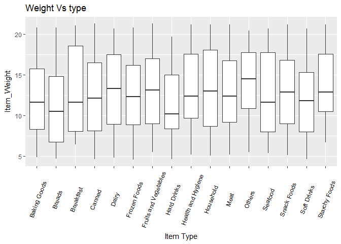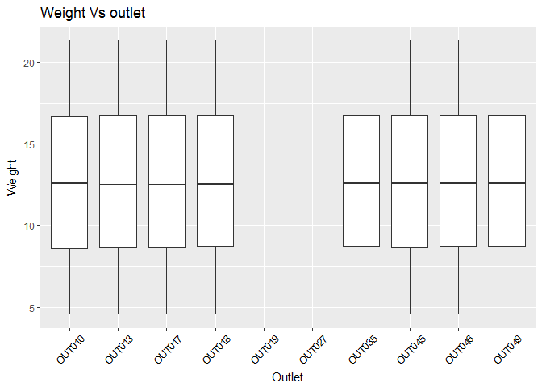

Only Outlets OUT019 and OUT027 are having missing values. Since each Item\_Identifier is related to product type, Missing values in Item weight can filled using weights of same Products from other stores.

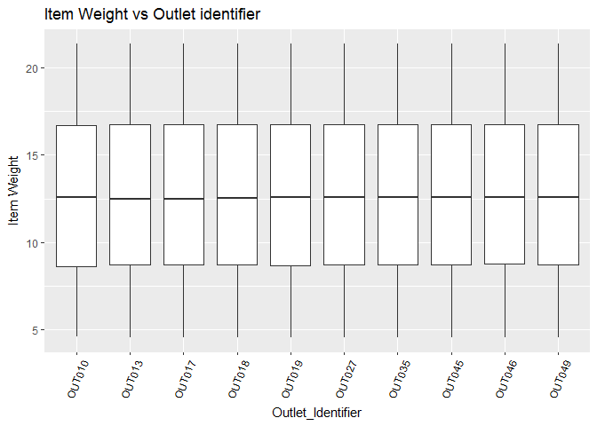

Looks like our Imputing is very accurate. All the medians, boxes and whiskers are identical to each other. This is genrally unusual and not seen very often. This is because these missings values are intentionally created by competition conductors. But in general we should know why and how missing values will be generated in the data and try to impute accordingly.

Item\_Fat\_Content
------------------

    ##      LF low fat Low Fat     reg Regular 
    ##     522     178    8485     195    4824

LF, low fat and Low Fat all represent same. Similarly reg and Regular are same. So let's change that. we replace LF and low fat by 'Low Fat' and reg, Regular by 'Regular'.

Further, there are different types of non-consumables products such as Health and Hygiene, Household and Others are either Low Fat or Regular according to the data. But Clearly, this makes no sense assing some amount of fat to utensils or household products. Hence, we introduce an new fat level None for these levels.

    ## Low Fat Regular    None 
    ##    6499    5019    2686

Item\_Visibility
----------------

Now let's check the Item\_Visibility variable, i.e. it is the percentage of display space in a store given to that particular item. Looking at the average visibility of items given in each store type and outlet,

    ##    Min. 1st Qu.  Median    Mean 3rd Qu.    Max. 
    ## 0.00000 0.02704 0.05402 0.06595 0.09404 0.32840

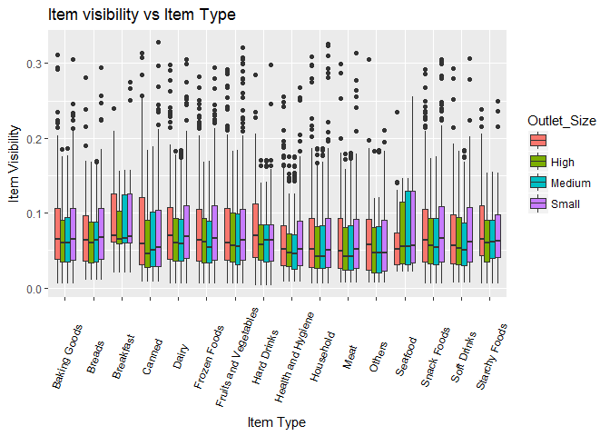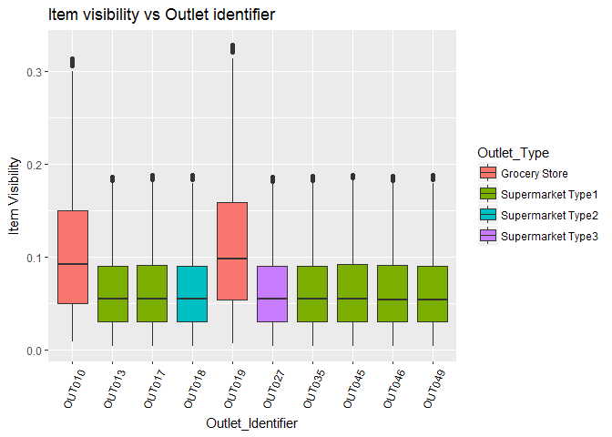

This plots confirms that grocery stores have a smaller selection of wares on offer, i.e. the average visibility per item is higher than in supermarkets. Also, we again see that the median visibilities in supermarkets on the one hand and grocery stores on the other are suspiciously similar. Is this again a hint on how those data were generated?

A problem is that plenty of visibilities in the data are 0. Clearly, this is non-sensical. If an item is not physically on display in a store it cannot be sold there. The simplest approach would be to replace those zeroes by the median visibilities. However, given that those medians are pretty much all the same, this would lead to a huge spike in the distribution of visibilities, i.e. it would greatly distort those distributions. A smarter approach is to change this zero values to NA (missing values) and impute them using either the package mice or manually by predictive mean matching. I have done it manual coding so that it runs faster and takes less time than mice package.

Comparing the densities of existing non-zero and imputed visibilities,

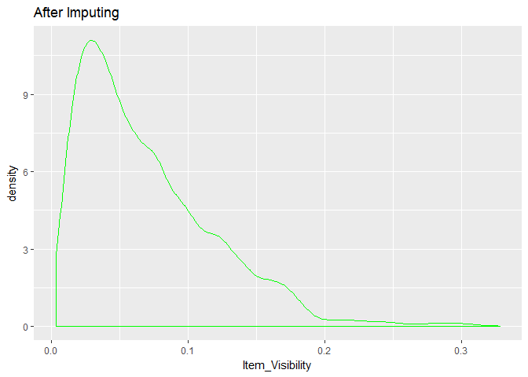

    ##     Min.  1st Qu.   Median     Mean  3rd Qu.     Max. 
    ## 0.003575 0.031330 0.057870 0.070380 0.097770 0.328400

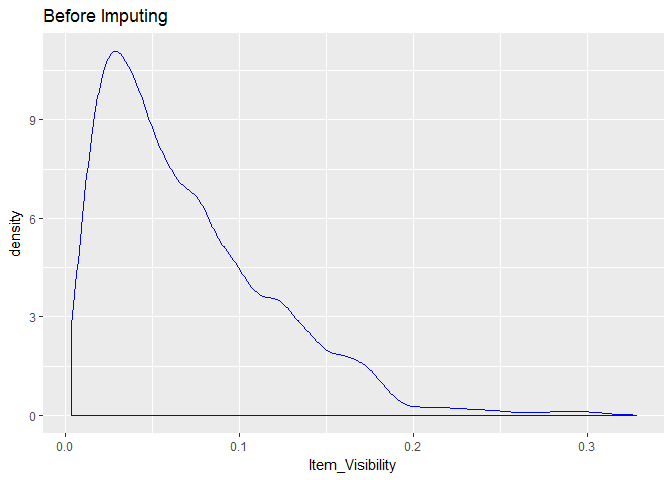

    ##     Min.  1st Qu.   Median     Mean  3rd Qu.     Max. 
    ## 0.003575 0.031400 0.057850 0.070300 0.097620 0.328400

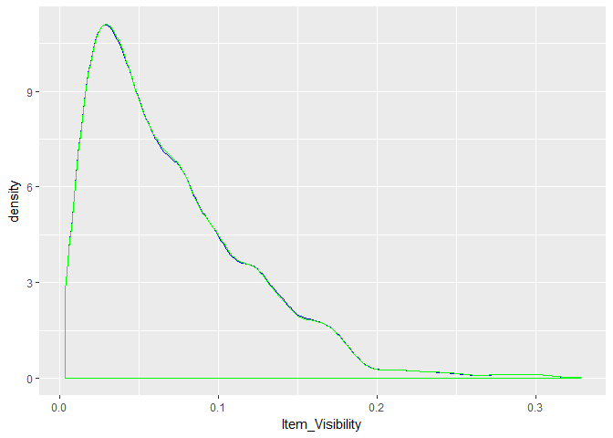

we see that the two distributions looks almost similar. And also the summary of distribution is same. SO our imuptation doesn't change any distribution patterns in Item\_Visibility.

Finally, we normalize all visibilities such that their sum, i.e. the total item visibility per shop, is 100, as it should be.

Item\_MRP
---------

Price of each product. First we will look at its summary and see its distribution visually.

    ##    Min. 1st Qu.  Median    Mean 3rd Qu.    Max. 
    ##   31.29   94.01  142.20  141.00  185.90  266.90

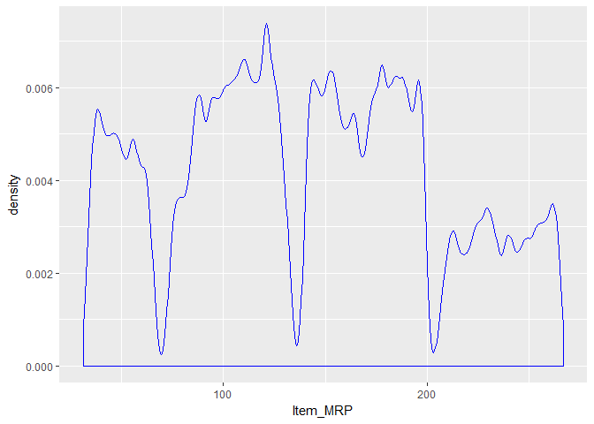

As we can see clearly there are different price level distributions. So we can create a new factor variable which represents these four levels to add more granurality to data.

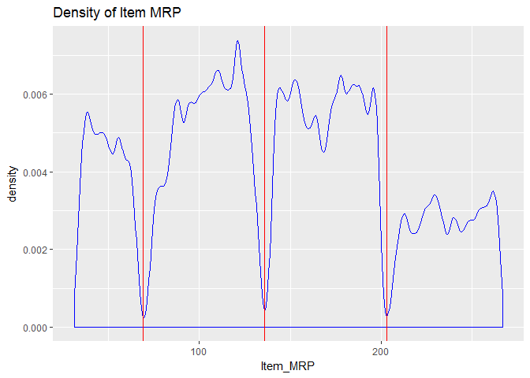

Outlet Establishment year
-------------------------

    ##    Min. 1st Qu.  Median    Mean 3rd Qu.    Max. 
    ##    1985    1987    1999    1998    2004    2009

Year a shop has been operating. This is a numeric variable. Years from 1985 to 2009. Given the data is sales figure of 2013. We can create a new variable related to number of years of establishment for each store.

Outlet Size
-----------

    ##          High Medium  Small 
    ##   4016   1553   4655   3980

Some entries in the category Outlet\_Size are empty. To tackle that problem, let's explore sales in various outlets. Counting how many sales where reported by each outlet, here we train data set instead of fulldata.

    ##         
    ##          Grocery Store Supermarket Type1 Supermarket Type2
    ##                    925              3091                 0
    ##   High               0              1553                 0
    ##   Medium             0              1550              1546
    ##   Small            880              3100                 0
    ##         
    ##          Supermarket Type3
    ##                          0
    ##   High                   0
    ##   Medium              1559
    ##   Small                  0

    ##         
    ##          OUT010 OUT013 OUT017 OUT018 OUT019 OUT027 OUT035 OUT045 OUT046
    ##             925      0   1543      0      0      0      0   1548      0
    ##   High        0   1553      0      0      0      0      0      0      0
    ##   Medium      0      0      0   1546      0   1559      0      0      0
    ##   Small       0      0      0      0    880      0   1550      0   1550
    ##         
    ##          OUT049
    ##               0
    ##   High        0
    ##   Medium   1550
    ##   Small       0

    ##                    
    ##                     OUT010 OUT013 OUT017 OUT018 OUT019 OUT027 OUT035
    ##   Grocery Store        925      0      0      0    880      0      0
    ##   Supermarket Type1      0   1553   1543      0      0      0   1550
    ##   Supermarket Type2      0      0      0   1546      0      0      0
    ##   Supermarket Type3      0      0      0      0      0   1559      0
    ##                    
    ##                     OUT045 OUT046 OUT049
    ##   Grocery Store          0      0      0
    ##   Supermarket Type1   1548   1550   1550
    ##   Supermarket Type2      0      0      0
    ##   Supermarket Type3      0      0      0

    ##    Category    x
    ## 1    OUT010  925
    ## 2    OUT013 1553
    ## 3    OUT017 1543
    ## 4    OUT018 1546
    ## 5    OUT019  880
    ## 6    OUT027 1559
    ## 7    OUT035 1550
    ## 8    OUT045 1548
    ## 9    OUT046 1550
    ## 10   OUT049 1550

clear from the above tables that grocery stores are small sized. And some of the groery store outlet size have not been assigned. clearly, the two grocery stores, OUT010 and OUT019 have reported far less data than the supermarkets. From the data and their description it's not really clear why. In the following I'll assume that it's just because they are much smaller and therefore have a smaller selection of goods to buy. As a check let's count the Item IDs:

    ##    Outlet_Identifier       Outlet_Type Outlet_Location_Type Outlet_Size
    ## 1             OUT017 Supermarket Type1               Tier 2            
    ## 2             OUT045 Supermarket Type1               Tier 2            
    ## 3             OUT010     Grocery Store               Tier 3            
    ## 4             OUT013 Supermarket Type1               Tier 3        High
    ## 5             OUT049 Supermarket Type1               Tier 1      Medium
    ## 6             OUT018 Supermarket Type2               Tier 3      Medium
    ## 7             OUT027 Supermarket Type3               Tier 3      Medium
    ## 8             OUT019     Grocery Store               Tier 1       Small
    ## 9             OUT046 Supermarket Type1               Tier 1       Small
    ## 10            OUT035 Supermarket Type1               Tier 2       Small
    ##    number
    ## 1    1543
    ## 2    1548
    ## 3     925
    ## 4    1553
    ## 5    1550
    ## 6    1546
    ## 7    1559
    ## 8     880
    ## 9    1550
    ## 10   1550

What else can we learn about the different types of shops?

boxplot of Sales vs. Outlet identifier

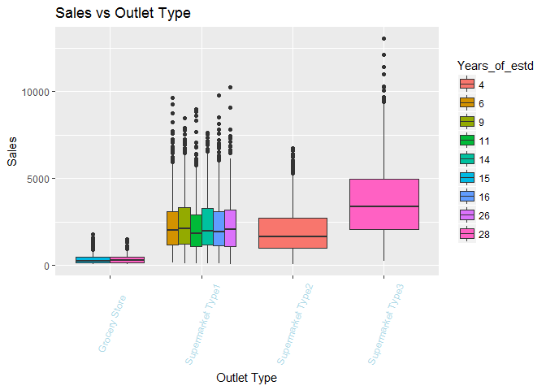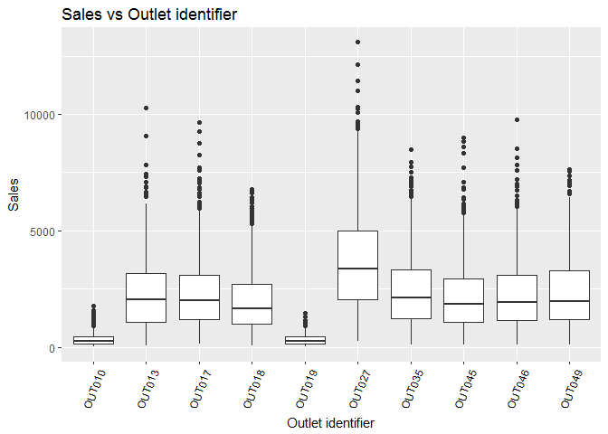

From above tables and visualization we can conclude that the missing values in the outlet size category concern one grocery store and two type 1 supermarkets. From what we have seen above, grocery stores and supermarket type one falls in one category that is size small.

Now let's check the rest of Store related variables.

Outlet\_Loction\_Type
---------------------

    ## Tier 1 Tier 2 Tier 3 
    ##   3980   4641   5583

Outlet stores are located in three different types of cities. Furthur we will see which tier is contributing more to sales.

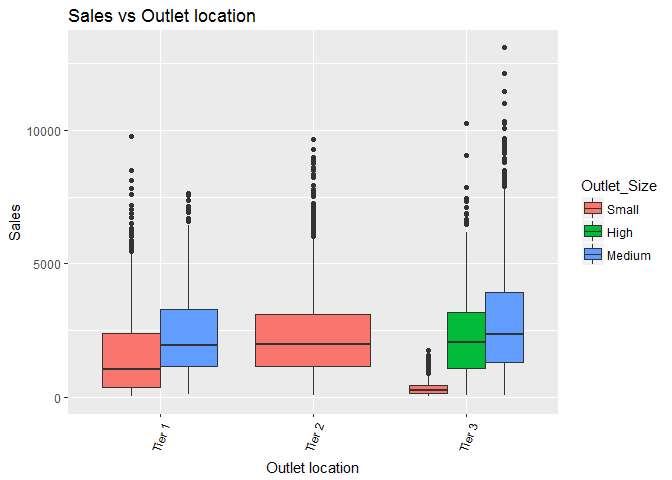

Outlet\_Type
------------

    ##     Grocery Store Supermarket Type1 Supermarket Type2 Supermarket Type3 
    ##              1805              9294              1546              1559

Four different types of stores. Grocery and three different Supermarkets type stores. Next we will see which type of stores are contributing more to sales.

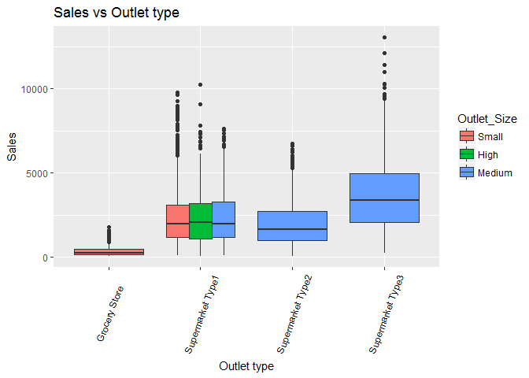

Let's Check visually the Sales in different Items in different stores, cities, outlets

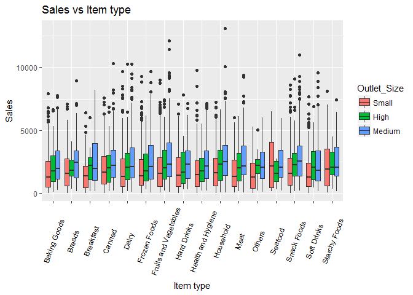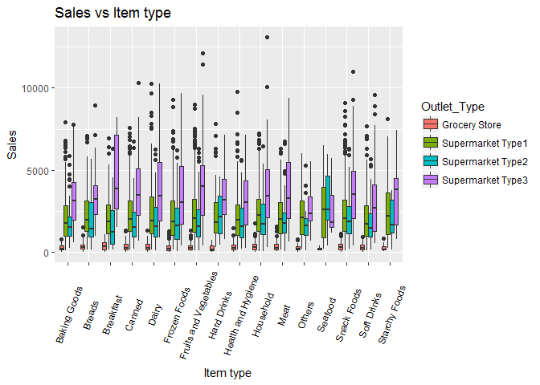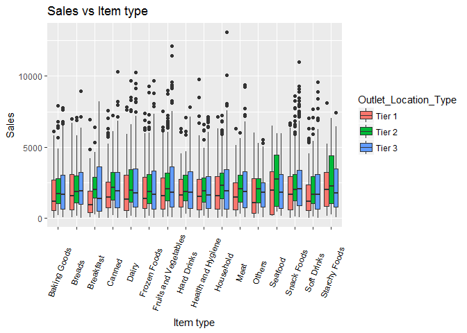

Looking at sales figures for various item types, they are plenty of outliers. Dividing Item\_Outlet\_Sales by Item\_MRP helps to reign in some outliers in the plot shown above:


let's find out the correlation among numerical variables
--------------------------------------------------------

    ##                           Item_Weight Item_Visibility     Item_MRP
    ## Item_Weight                1.00000000    -0.020469947  0.026172322
    ## Item_Visibility           -0.02046995     1.000000000 -0.006278892
    ## Item_MRP                   0.02617232    -0.006278892  1.000000000
    ## Outlet_Establishment_Year -0.01282265    -0.078040453  0.005019916
    ## Item_Outlet_Sales          0.01326124    -0.130963461  0.567574447
    ##                           Outlet_Establishment_Year Item_Outlet_Sales
    ## Item_Weight                            -0.012822647        0.01326124
    ## Item_Visibility                        -0.078040453       -0.13096346
    ## Item_MRP                                0.005019916        0.56757445
    ## Outlet_Establishment_Year               1.000000000       -0.04913497
    ## Item_Outlet_Sales                      -0.049134970        1.00000000

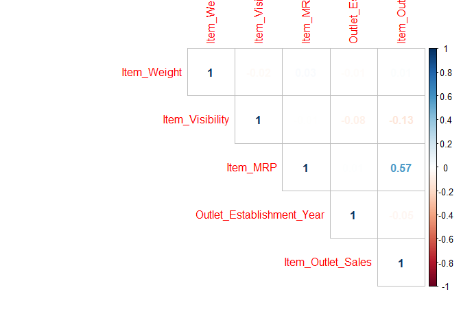

Item\_Outlet\_Sales has a strong positive correlation with Item\_MRP and a somewhat weaker negative one with Item\_Visibility. Positive correlation between Item\_MRP and Item\_Outlet\_Sales, this is simply due to the fact that sales figures are the number of sold items times their price. We have divided Item\_Outlet\_Sales by Item\_MRP above to reduce outliers. Here this reduces correlation.

We will check these relations with other variables. Again we notice there is a huge difference in between grocery stores and supermarkets. This can seen in numers and can clearly be seen in a scatter plot of sales vs. visibilities:

    ##     Grocery Store Supermarket Type1 Supermarket Type2 Supermarket Type3 
    ##          339.8285         2316.1811         1995.4987         3694.0386

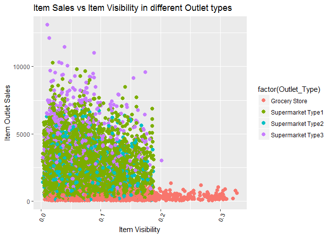

From the above table we see that average sales in Supermarket type 1 and 2 are almost close and those figures are far away from grocery stores and supermarket type 3. So we can combine them into a single level.

Proper Validation
-----------------

Cross validation is an essential step in model training. It tells us whether our model is at high risk of overfitting. In many competitions, public LB scores are not very reliable. Often when we improve the model and get a better local CV score, the LB score becomes worse. It is widely believed that we should trust our CV scores under such situation. Ideally we would want CV scores obtained by different approaches to improve in sync with each other and with the LB score, but this is not always possible.

Usually 5-fold CV is good enough. If we use more folds, the CV score would become more reliable, but the training takes longer to finish as well. However, we shouldn’t use too many folds if our training data is limited. Otherwise we would have too few samples in each fold to guarantee statistical significance.

How to do CV properly is not a trivial problem. It requires constant experiment and case-by-case discussion. Many Kagglers share their CV approaches ([like this one](https://www.kaggle.com/c/telstra-recruiting-network/discussion/19277)) after competitions when they feel that reliable CV is not easy.

Model Selection and Summary
---------------------------

When the features are set, we can start training models. Kaggle competitions usually favor tree-based models: Gradient Boosted Trees Random Forest

We can improve a model’s performance by tuning its parameters. A model usually have many parameters, but only a few of them are significant to its performance. For example, the most important parameters for a random forset is the number of trees in the forest and the maximum number of features used in developing each tree. We need to understand how models work and what impact does each parameter have to the model’s performance, be it accuracy, robustness or speed. In order to find a decent model to predict sales I performed an extensive search of various machine learning models available in R, in particular of those accessible through the caret wrapper. Since my laptop does not have a high processor and ram, I have to stick with basic models and rely mainly on feature Engneering. But in general, without Esembling you will not get very high score in competitions. So for begineers(like me) concentrate mainly on visulaization, finding patterns in the data, creating new features that can increase your score.
